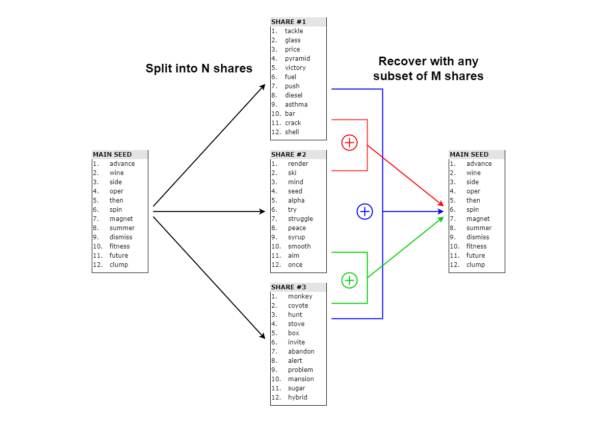

# BIP39 - Shamir's secret sharing scheme
This repository is a proof of concept to use the Shamir's secret scheme applied to BIP39 mnemonic (also called mnemonic sentence, mnemonic words, seed phrase). The idea is to divide a backup seed phrase into N subshares which are encoded into mnemonic sentence as well. You can recover your original seed with a minimum of M of these subshares. Like 2 out of 3 shares, 3 out ou 5, 4 out of 6, etc.

This software is provided free of use and comes with no warranty, **use at you own risk**.




# Why?
You generated a HD wallet offline or purcharsed a hardware wallet, e.g. a Ledger or a Trezor. You have a list of 12 or 24 words as a backup to your wallet. If you lose your seed phrase, you won't be able to recover your coins. So now you are facing a security issue for yourself. You must hide your backup and everyone who knows about it could steal your funds. What if you lose your piece of paper in a fire? How would you be sure that your funds are passed on to your children when you die?

The most common solutions to this problem are:
* Create multiple copies of your seed phrase. The more copies you create, the bigger the risk that one of them is discovered and your funds stolen or seized.
* Split your seed phrase in multiple partial copies. If you have a list of 24 words, you may be tempted to use this scheme with 3 shares, e.g. share 1 has words from 1 to 16, share 2 has words from 9 to 24 and share 3 has words 1 to 8 and 17 to 24. You need any 2 of the 3 shares to recover your seed phrase. You keep one, you give one to your significant other, and put one in a safe-deposit box for instance. The scheme is simple enough but now a share holder has a lot of information about your original seed phrase. The security of your backup is reduced by many orders of magnitude. What if you have only 12 words? With only 4 words to guess, there are only about 1 trillion valid possibilities remaining and your wallet is now vulnerable to a brute force attack by any one who accessed one of the share. What if you want another repartition, like 3 out of 5 shares?

# Solution proposed
Shamir's secret sharing scheme (SSS) is a way to split a secret between N shares where any subset of M shares can recover the secret. It's based on integers defined under a (big) prime and polynomial functions. Knowing any number of shares below the threshold M doesn't reveal any information about the secret. See the [Wikipedia page](https://en.wikipedia.org/wiki/Shamir%27s_Secret_Sharing) for more information.

You can convert integers to bytes and the seed phrase is just some bytes with a checksum. So your mnemonic can be converted to an integer and vice versa.
This package propose a solution to generate shares as described in BIP-0039 in the form of seed phrases with the SSS scheme. You can choose to generate N shares to distribute and M the subset number of shares required to restore your original seed. You can now increase your ability to recover from a loss without jeopardizing your security. One of the share is stolen, goes missing or was potentially accessed by an outsider? Destroy all the other shares and generate new ones. Your wallet is as safe a before.

# How?

## Set up a secure environment
Never ever enter your seed on a computer that doesn't run in a secure environment. Any computer that was once connected to the internet is vulnerable.

1. I recommend using a **linux live distribution run from a USB key**, see for example a list of live [debian](https://www.debian.org/CD/live/) or [Ubuntu](https://ubuntu.com/download/desktop) distributions. They include python 3 so you can run the command out of the box. When you run it. You can create the bootable USB using Rufus on Windows for example. I recommend creating a disk partition on the key when doing so. That way you can add the files to generate a mnemonic, recover one or generate random shares. 

2. **Verify** the software's release signatures from an alternative device and internet connection (e.g., your smartphone). This makes sure you are not using a malicious program, both for the linux live distribution and this source code.

The SHA256 checksum of the directory [src](/src) is (data only):
```
BF2302754FF018934952E47C75661EDBFFE42C66DF113ED13CDE196326A72AFC
```

3. Search for a tutorial on how to boot to a USB key on your machine.

4. When you boot to your live distribution, your machine must be disconnected from the internet, that means that you have to **unplug your network** cable and disable wireless on your computer or router and bluetooth if it's activated. This prevent malwares and keyloggers from getting your seed. You still need to pay attention to hardware loggers and people watching over your shoulder. [Source](https://en.bitcoin.it/wiki/How_to_set_up_a_secure_offline_savings_wallet).

Once you are done, remember to never take a photo of your seed/share as your phone can be stolen or your cloud account hacked. Never print it as most printers store the documents printed in their memory and attackers can retrieve them.

## Mount the USB key
1. To see all disks connected, run the command. 
```
sudo fdisk –l
```
You will see that your USB key is probably `/dev/sdb1` and `/dev/sdb2` if you did a partition. Let's assume you put the code in `/dev/sdb2`.

2. Let's create a directory to mount the disk where the code is stored:
```
sudo mkdir /media/usb
```

3. Mount the disk on this directory, e.g.: 
```
sudo mount /dev/sdb2 /media/usb/
```
4. You can check if it it worked with:
```
mount | grep sdb2
```
5. Go to the directory you created in the `/src` to run the code:
```
cd /media/usb/src
```

## General information
It is very important to **write the share number** when splitting your mnemonic. This will be asked at the time of the recovery. It is good to take note of the prime as well. It's the same for all shares. This is the best prime for your level of strength, yet it is not impossible that the default value will be changed the future. If you do generate shares and don't intend to save the original seed phrase, I recommend you **keep a copy of this software** so you are autonomous to build back the mnemonic in case this project is not accessible anymore or if it changes so much that it's not compatible with your shares anymore.

### Conversion
Here is the rule to convert the strength of a seed phrase to the number of words:
- 12 words = 128 bits
- 15 words = 160 bits
- 18 words = 192 bits
- 21 words = 224 bits
- 24 words = 256 bits

## Generate a mnemonic with N shares and a threshold of M shares to recover the original seed
```
python3 make_shares.py -g 256 -M 3 -N 5
```

This example command line will generate 5 shares in the form of seed phrases of 24 words (by default). You will need 3 of them to recover your main seed which as a strength of 256 bits or 24 words.

You can use the main seed generated in a hardware wallet. If you are confident enough in your shares, you can discard the main mnemonic.

Note: if you want shares to be other than 24 words, you can add the parameter `--share_strength` followed by the security strength in bits (see above for the conversion bits <-> number of words). The strength of the share can only be equal or greater than the strength of the main seed.

## Provide your own seed
```
python3 make_shares.py -M 2 -N 3 -s "force hard indoor always action leg board leg build derive appear cream" --share_strength 128
```

Now you used your own seed to generate 3 shares that are 12 words long (share_strength = 128 bits -> 12 words) of which 2 are required to find the original one.

Again, if you are confident enough in your 3 shares and in your ability to recover, you can destroy your main mnemonic. You can ask for a share strength that is bigger than your original mnemonic. In the example above, changing the parameter `--share_strength 256` will create lists of 24 words as new backups. This parameter can only be greater or equals to the strength of your main seed.

## Recover the original mnemonic words
```
python3 recover_seed.py
```
The program will guide you through the step to get back the main seed with your subset of shares. Please enter the share mnemonics in lower case, with each word separated by a SPACE, just like this:
```
force hard indoor always action leg board leg build derive appear cream
```

# Credits
Shamir's secret share with integers was modified from [the Wikipedia page](https://en.wikipedia.org/wiki/Shamir%27s_Secret_Sharing).

[Mnemonic class](/src/mnemonic.py) is copied from the [trezor/python-mnemonic](https://github.com/trezor/python-mnemonic) v0.20. It's copied to avoid dependencies and to make it simpler to run the code offline.

# Final note
Please be aware that this software comes with no warranty so be careful and **use it at your own risk**. I'm not a cryptography nor a security expert. Any mistake can result in the total loss of your funds.
